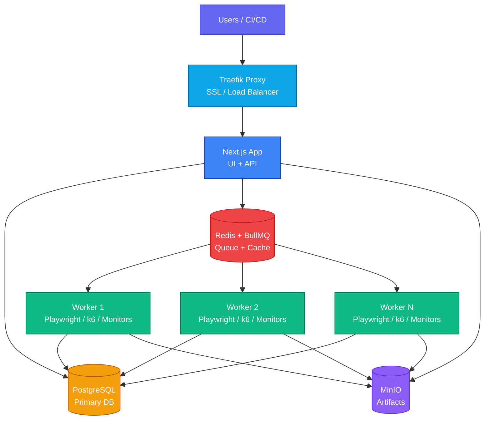

Deploy Supercheck on your own infrastructure. Production self-hosting uses Docker Compose for the app stack and local K3s + gVisor for the execution plane, so self-hosted and cloud deployments share the same per-run execution model.

<Callout type="info">
For true multi-location monitoring, see [Multi-Location Workers](/docs/app/deployment/multi-location).
</Callout>

## Quick Start

[](https://github.com/supercheck-io/supercheck/blob/main/deploy/coolify/README.md)

Coolify template deployment for Linux hosts. Run `setup-k3s.sh` on the host first so the worker can use the Kubernetes + gVisor execution backend.

<Callout type="warn">
Self-hosted production is no longer a pure Docker-only deployment. The long-lived services stay in Docker Compose, but Playwright and k6 runs execute in local K3s under gVisor.
</Callout>

---

## Docker Compose

Choose your deployment type:

<Tabs items={['Local Testing', 'Production (HTTPS)']}>
  <Tab value="Local Testing">
    Best for local iteration or internal testing without a domain. Uses the same K3s + gVisor execution model as production.

    ### 1. Install Docker

    <Callout type="warn">
    Local testing with the supported execution model is intended for Linux hosts. Docker Desktop is fine for evaluation, but it is not the supported self-hosted execution target.
    </Callout>

    <Tabs items={['macOS', 'Windows', 'Linux']}>
      <Tab value="macOS">
        Download and install [Docker Desktop](https://www.docker.com/products/docker-desktop/) for Mac.
      </Tab>
      <Tab value="Windows">
        Download and install [Docker Desktop](https://www.docker.com/products/docker-desktop/) for Windows.
      </Tab>
      <Tab value="Linux">
        ```bash
        curl -fsSL https://get.docker.com | sh
        sudo usermod -aG docker $USER
        newgrp docker
        ```
      </Tab>
    </Tabs>

    ### 2. Clone and Configure

    ```bash
    git clone https://github.com/supercheck-io/supercheck.git
    cd supercheck/deploy/docker

    # Generate secrets
    sudo bash init-secrets.sh

    # Install local K3s + gVisor and create a restricted worker kubeconfig
    sudo bash setup-k3s.sh
    ```

    Edit `.env` only if you want optional integrations (SMTP, AI, or OAuth).

    ### 3. Deploy

    ```bash
    KUBECONFIG_FILE=/etc/rancher/k3s/supercheck-worker.kubeconfig docker compose -f docker-compose-local.yml up -d --build
    ```

    ### 4. Access

    Open `http://localhost:3000` and create your first account with email/password.
    If OAuth is configured, you can also sign in with GitHub/Google.

    **Create Super Admin (Optional):**
    ```bash
    docker compose -f docker-compose-local.yml exec app npm run setup:admin your-email@example.com
    ```
  </Tab>

  <Tab value="Production (HTTPS)">
    Recommended production path. Uses the same Kubernetes Job + gVisor execution model as cloud.

    ### 1. Install Docker

    <Callout type="warn">
    Production self-hosting is intended for Linux hosts. Docker Desktop on macOS/Windows is fine for local evaluation, but local K3s + gVisor on Linux is the supported production path.
    </Callout>

    <Tabs items={['macOS', 'Windows', 'Linux']}>
      <Tab value="macOS">
        Download and install [Docker Desktop](https://www.docker.com/products/docker-desktop/) for Mac.
      </Tab>
      <Tab value="Windows">
        Download and install [Docker Desktop](https://www.docker.com/products/docker-desktop/) for Windows.
      </Tab>
      <Tab value="Linux">
        ```bash
        curl -fsSL https://get.docker.com | sh
        sudo usermod -aG docker $USER
        newgrp docker
        ```
      </Tab>
    </Tabs>

    ### 2. Configure DNS

    Add these records at your domain provider:

    | Type | Name | Value |
    |------|------|-------|
    | A | `app` | Your Server IP |
    | A | `*` | Your Server IP |

    <Callout type="info">
    The wildcard (`*`) record enables status page subdomains like `status.yourdomain.com`.
    </Callout>

    <Callout type="warn">
    **Cloudflare Users**: If using Cloudflare proxy (orange cloud), set SSL/TLS mode to **"Full"** or **"Full (Strict)"** in your Cloudflare Dashboard. The default "Flexible" mode causes redirect loops. Other DNS providers may have similar TLS/SSL settings.
    </Callout>

    Verify DNS propagation:
    ```bash
    dig +short app.yourdomain.com
    ```

    ### 3. Clone and Configure

    ```bash
    git clone https://github.com/supercheck-io/supercheck.git
    cd supercheck/deploy/docker

    # Generate secrets
    sudo bash init-secrets.sh

    # Install local K3s + gVisor and create a restricted worker kubeconfig
    sudo bash setup-k3s.sh
    ```

    Edit `.env`:

    ```bash
    # Domain (required)
    APP_DOMAIN=app.yourdomain.com
    ACME_EMAIL=admin@yourdomain.com
    STATUS_PAGE_DOMAIN=yourdomain.com

    # Optional OAuth (GitHub/Google)
    # GITHUB_CLIENT_ID=your-github-client-id
    # GITHUB_CLIENT_SECRET=your-github-client-secret
    # GOOGLE_CLIENT_ID=your-client-id.apps.googleusercontent.com
    # GOOGLE_CLIENT_SECRET=your-google-client-secret
    ```

    <Callout type="info">
    Set `STATUS_PAGE_DOMAIN` to the base hostname only (for example `yourdomain.com`).
    </Callout>

    <Callout type="warn">
    The `STATUS_PAGE_DOMAIN` namespace is reserved for default status page URLs (`[uuid].STATUS_PAGE_DOMAIN`). Do not set a status page custom domain to `STATUS_PAGE_DOMAIN` itself or one of its subdomains.
    </Callout>

    <Callout type="info">
    **Custom domains for status pages** work out of the box. The default Traefik configuration includes a catch-all route that automatically provisions Let's Encrypt certificates for any custom domain pointed at your server via CNAME.
    </Callout>

    ### 4. Deploy

    ```bash
    KUBECONFIG_FILE=/etc/rancher/k3s/supercheck-worker.kubeconfig docker compose -f docker-compose-secure.yml up -d
    ```

    ### 5. Access

    Open `https://app.yourdomain.com` and create your first account with email/password.
    If OAuth is configured, you can also sign in with GitHub/Google.

    **Create Super Admin (Optional):**
    ```bash
    docker compose -f docker-compose-secure.yml exec app npm run setup:admin your-email@example.com
    ```
  </Tab>
</Tabs>

---

## Optional: OAuth Setup

<Callout type="info">
OAuth is optional. If you skip OAuth, users can sign up with email/password.
</Callout>

<Accordions>
  <Accordion title="GitHub OAuth">
    1. Go to [GitHub Developer Settings](https://github.com/settings/developers)
    2. Click **OAuth Apps** → **New OAuth App**
    3. Set Homepage URL: `https://app.yourdomain.com` (or `http://localhost:3000` for local)
    4. Set Callback URL: `https://app.yourdomain.com/api/auth/callback/github`
    5. Copy Client ID and generate Client Secret
    6. Add to `.env`:
       ```bash
       GITHUB_CLIENT_ID=your-client-id
       GITHUB_CLIENT_SECRET=your-client-secret
       ```
  </Accordion>
  <Accordion title="Google OAuth">
    1. Go to [Google Cloud Console](https://console.cloud.google.com/)
    2. Create a project → **APIs & Services** → **Credentials**
    3. Configure OAuth consent screen (External)
    4. Create **OAuth client ID** (Web application)
    5. Set redirect URI: `https://app.yourdomain.com/api/auth/callback/google`
    6. Add to `.env`:
       ```bash
       GOOGLE_CLIENT_ID=your-client-id.apps.googleusercontent.com
       GOOGLE_CLIENT_SECRET=your-client-secret
       ```
  </Accordion>
</Accordions>

---

## Optional Configuration

<Accordions>
  <Accordion title="Registration Controls">
    Control who can sign up for your self-hosted instance.

    ```bash
    # Disable new user registration
    # Set to false after creating your initial account to lock down signup
    # Invited users can still register even when disabled
    SIGNUP_ENABLED=false

    # Restrict registration to specific email domains (comma-separated)
    # Leave empty or unset to allow all domains
    ALLOWED_EMAIL_DOMAINS=acme.com,acme.org
    ```

    | Variable | Default | Description |
    |----------|---------|-------------|
    | `SIGNUP_ENABLED` | `true` | Set to `false` to disable open registration |
    | `ALLOWED_EMAIL_DOMAINS` | *(empty)* | Comma-separated list of allowed email domains |

    <Callout type="info">
    When `SIGNUP_ENABLED=false`, users can still register via invitation links. This allows admins to control access while still inviting team members.
    </Callout>
  </Accordion>
  <Accordion title="Email (SMTP)">
    Required for alerts and team invitations.

    ```bash
    SMTP_HOST=smtp.gmail.com
    SMTP_PORT=587
    SMTP_FROM_EMAIL=notifications@yourdomain.com

    # Optional: set BOTH only if your SMTP provider requires authentication
    SMTP_USER=your-email@gmail.com
    SMTP_PASSWORD=your-app-password
    ```

    If your mail server allows relay without auth (for example, trusted internal Postfix),
    you can leave `SMTP_USER` and `SMTP_PASSWORD` empty, but keep `SMTP_FROM_EMAIL` set.

    **Recommended providers:** [Resend](https://resend.com), [SendGrid](https://sendgrid.com), [AWS SES](https://aws.amazon.com/ses/)
  </Accordion>
</Accordions>

### AI Configuration

Enable AI-powered test creation, fixes, and performance analysis. Choose your provider:

<Tabs items={['OpenAI', 'Azure OpenAI', 'Anthropic', 'Gemini', 'Vertex AI', 'Bedrock', 'OpenRouter']}>
  <Tab value="OpenAI">
    **Recommended for most users.**
    
    ```bash
    AI_PROVIDER=openai
    AI_MODEL=gpt-4o-mini
    OPENAI_API_KEY=sk-your-api-key
    ```
  </Tab>
  <Tab value="Azure OpenAI">
    Enterprise-grade OpenAI hosting.

    ```bash
    AI_PROVIDER=azure
    AZURE_RESOURCE_NAME=your-resource-name
    AZURE_API_KEY=your-api-key
    AZURE_OPENAI_DEPLOYMENT=your-deployment-name
    ```
  </Tab>
  <Tab value="Anthropic">
    Claude models (Haiku, Sonnet, Opus).

    ```bash
    AI_PROVIDER=anthropic
    AI_MODEL=claude-3-5-haiku-20241022
    ANTHROPIC_API_KEY=sk-ant-your-key
    ```
  </Tab>
  <Tab value="Gemini">
    Google AI Studio (API Key).

    ```bash
    AI_PROVIDER=gemini
    AI_MODEL=gemini-2.5-flash
    GOOGLE_GENERATIVE_AI_API_KEY=your-api-key
    ```
  </Tab>
  <Tab value="Vertex AI">
    Google Cloud Vertex AI. Requires GCP project.

    ```bash
    AI_PROVIDER=google-vertex
    AI_MODEL=gemini-2.5-flash
    GOOGLE_VERTEX_PROJECT=your-project-id
    # Ensure ADC or GOOGLE_APPLICATION_CREDENTIALS are set in the container
    ```
  </Tab>
  <Tab value="Bedrock">
    AWS Bedrock.

    ```bash
    AI_PROVIDER=bedrock
    AI_MODEL=anthropic.claude-3-5-haiku-20241022-v1:0
    BEDROCK_AWS_REGION=us-east-1
    BEDROCK_AWS_ACCESS_KEY_ID=your-access-key
    BEDROCK_AWS_SECRET_ACCESS_KEY=your-secret-key
    ```
  </Tab>
  <Tab value="OpenRouter">
    Access to 400+ models via single API.

    ```bash
    AI_PROVIDER=openrouter
    AI_MODEL=anthropic/claude-3.5-haiku
    OPENROUTER_API_KEY=your-api-key
    ```
  </Tab>
</Tabs>


---

## Operations

### Scaling Workers

All supported self-hosted deployments now use the same execution model as cloud. The long-lived worker stays in Docker Compose as a control-plane container, but every Playwright and k6 run executes in its own ephemeral gVisor Job in the `supercheck-execution` namespace.

<Callout type="info">
**gVisor Sandbox:** `setup-k3s.sh` installs K3s, installs [gVisor](https://gvisor.dev), configures containerd with the `runsc` handler, creates the `gvisor` RuntimeClass, provisions the `supercheck-execution` namespace, applies the execution `LimitRange`, `ResourceQuota`, and `NetworkPolicy`, and writes `/etc/rancher/k3s/supercheck-worker.kubeconfig` for the Compose worker. The Docker worker container itself stays on the normal Docker runtime; only the per-run Kubernetes execution Jobs use gVisor.
</Callout>

<Callout type="info">
Single-location deployments should keep `WORKER_LOCATION=local` (the default). The `local` location is a built-in location exclusive to self-hosted deployments. This makes each worker process all regional queues on that server. When only one location is configured, the UI automatically skips location selection dialogs in monitor configuration, K6 tests, and job creation.
</Callout>

<Callout type="info">
Locations are managed by the Super Admin. To expand to multiple regions later, see [Multi-Location Workers](/docs/app/deployment/multi-location). You can add new locations via the Super Admin panel without modifying worker configuration.
</Callout>

<Callout type="info">
- `WORKER_REPLICAS`: Controls the number of worker containers. Set individually on each worker server.
- `RUNNING_CAPACITY`: Maximum concurrent test runs in running state. Set on the app server equal to total worker replicas across all servers.
- `QUEUED_CAPACITY`: Maximum queued test runs before rejecting submissions. Set on the app server based on your desired queue length.
</Callout>

```bash
# Scale to 2 workers
WORKER_REPLICAS=2 RUNNING_CAPACITY=2 QUEUED_CAPACITY=20 \
KUBECONFIG_FILE=/etc/rancher/k3s/supercheck-worker.kubeconfig \
docker compose up -d
```

| Configuration | `WORKER_REPLICAS` | `RUNNING_CAPACITY` | Minimum Server |
|---------------|-------------------|--------------------|----------------|
| **Small** | 1 | 1 | 2 vCPU / 4GB |
| **Medium** | 2 | 2 | 4 vCPU / 8GB |
| **Large** | 4 | 4 | 8 vCPU / 16GB |

### Backups

<Callout type="error">
**Critical:** Your data is in Docker volumes. Back up regularly!
</Callout>

```bash
# Create backup
docker compose exec postgres pg_dump -U postgres supercheck > backup.sql

# Restore backup
docker compose exec -T postgres psql -U postgres supercheck < backup.sql
```

### Updates

```bash
docker compose pull && \
KUBECONFIG_FILE=/etc/rancher/k3s/supercheck-worker.kubeconfig docker compose up -d
```

### Troubleshooting

```bash
docker compose logs app      # View app logs
docker compose ps            # Check service status
```

---

## Architecture



---

## Next Steps

<Cards>
  <Card
    icon={<MapPin className="text-emerald-500" />}
    title="Multi-Location Workers"
    description="Deploy workers in multiple regions for true global coverage"
    href="/docs/app/deployment/multi-location"
  />
</Cards>
