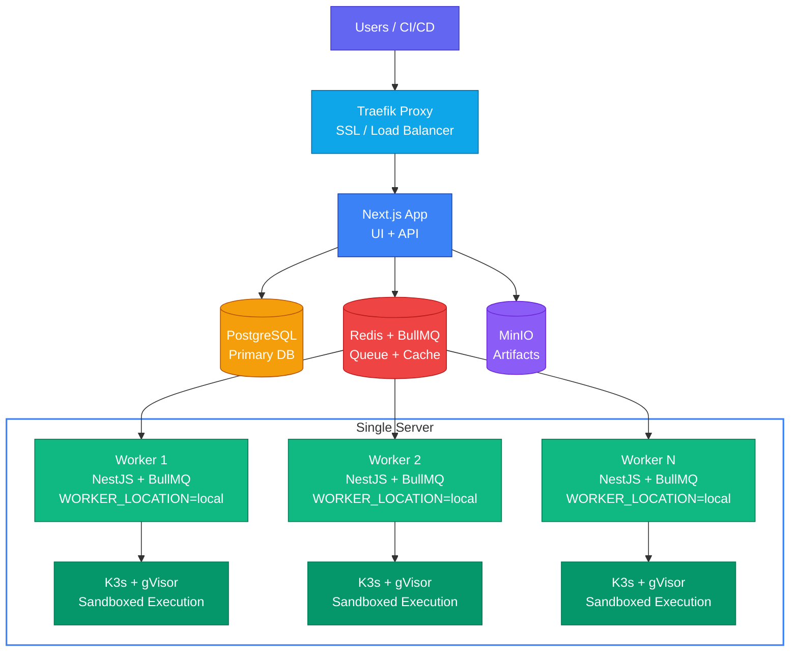

Deploy Supercheck on a single server with Docker Compose.

## Architecture



All services run on a single Linux server managed by Docker Compose. Workers consume jobs from Redis via BullMQ and execute each test as an ephemeral Kubernetes Job in a local [K3s](https://k3s.io) cluster, sandboxed with [gVisor](https://gvisor.dev/) for kernel-level isolation. Scale by increasing `WORKER_REPLICAS` or expanding to [multiple regions](/docs/app/deployment/multi-location).

---

## Docker Compose

<Tabs items={['Quick Start', 'Production (HTTPS)']}>
  <Tab value="Quick Start">
    <Steps>
      <Step>
        ### Install Docker

        <Callout type="warn">
        A **Linux server** is required (Ubuntu 22.04+, Debian 12+). Supercheck uses K3s and gVisor for sandboxed test execution, which require the Linux kernel. macOS, Windows, and WSL2 are not supported.
        </Callout>

        ```bash
        curl -fsSL https://get.docker.com | sh
        sudo usermod -aG docker $USER
        newgrp docker
        ```
      </Step>

      <Step>
        ### Clone and Configure

        ```bash
        git clone https://github.com/supercheck-io/supercheck.git
        cd supercheck/deploy/docker
        sudo bash init-secrets.sh
        ```

        Edit `.env` for optional integrations (SMTP, AI, OAuth).
      </Step>

      <Step>
        ### Set Up Execution Sandbox

        ```bash
        sudo bash setup-k3s.sh
        ```

        This installs [K3s](https://k3s.io) with [gVisor](https://gvisor.dev) for sandboxed Playwright and K6 execution.
      </Step>

      <Step>
        ### Deploy

        ```bash
        KUBECONFIG_FILE=/etc/rancher/k3s/supercheck-worker.kubeconfig docker compose up -d
        ```
      </Step>

      <Step>
        ### Access

        Open `http://localhost:3000` and create your account.

        ```bash
        # Optional: grant super admin
        docker compose exec app npm run setup:admin your-email@example.com
        ```
      </Step>
    </Steps>
  </Tab>

  <Tab value="Production (HTTPS)">
    <Steps>
      <Step>
        ### Install Docker

        <Callout type="warn">
        A **Linux server** is required (Ubuntu 22.04+, Debian 12+). Supercheck uses K3s and gVisor for sandboxed test execution, which require the Linux kernel. macOS, Windows, and WSL2 are not supported.
        </Callout>

        ```bash
        curl -fsSL https://get.docker.com | sh
        sudo usermod -aG docker $USER
        newgrp docker
        ```
      </Step>

      <Step>
        ### Configure DNS

        | Type | Name | Value |
        |------|------|-------|
        | A | `app` | Your Server IP |
        | A | `*` | Your Server IP |

        <Callout type="info">
        The wildcard (`*`) record enables status page subdomains like `status.yourdomain.com`.
        </Callout>

        <Callout type="warn">
        **Cloudflare Users**: Set SSL/TLS mode to **"Full"** or **"Full (Strict)"**.
        </Callout>
      </Step>

      <Step>
        ### Clone and Configure

        ```bash
        git clone https://github.com/supercheck-io/supercheck.git
        cd supercheck/deploy/docker
        sudo bash init-secrets.sh
        ```

        Edit `.env`:

        ```bash
        APP_DOMAIN=app.yourdomain.com
        ACME_EMAIL=admin@yourdomain.com
        STATUS_PAGE_DOMAIN=yourdomain.com
        ```

        <Callout type="info">
        `STATUS_PAGE_DOMAIN` is used for default status page URLs (`[uuid].STATUS_PAGE_DOMAIN`). Custom domains work automatically via Traefik's catch-all Let's Encrypt route.
        </Callout>
      </Step>

      <Step>
        ### Set Up Execution Sandbox

        ```bash
        sudo bash setup-k3s.sh
        ```

        This installs [K3s](https://k3s.io) with [gVisor](https://gvisor.dev) for sandboxed Playwright and K6 execution.
      </Step>

      <Step>
        ### Deploy

        ```bash
        KUBECONFIG_FILE=/etc/rancher/k3s/supercheck-worker.kubeconfig docker compose -f docker-compose-secure.yml up -d
        ```
      </Step>

      <Step>
        ### Access

        Open `https://app.yourdomain.com` and create your account.

        ```bash
        # Optional: grant super admin
        docker compose -f docker-compose-secure.yml exec app npm run setup:admin your-email@example.com
        ```
      </Step>
    </Steps>
  </Tab>
</Tabs>

---

## Optional Configuration

<Accordions>
  <Accordion title="OAuth (GitHub / Google)">
    <Tabs items={['GitHub', 'Google']}>
      <Tab value="GitHub">
        1. Go to [GitHub Developer Settings](https://github.com/settings/developers) → **OAuth Apps** → **New OAuth App**
        2. Set Callback URL: `https://app.yourdomain.com/api/auth/callback/github`
        3. Add to `.env`:
           ```bash
           GITHUB_CLIENT_ID=your-client-id
           GITHUB_CLIENT_SECRET=your-client-secret
           ```
      </Tab>
      <Tab value="Google">
        1. Go to [Google Cloud Console](https://console.cloud.google.com/) → **APIs & Services** → **Credentials**
        2. Create **OAuth client ID** with redirect URI: `https://app.yourdomain.com/api/auth/callback/google`
        3. Add to `.env`:
           ```bash
           GOOGLE_CLIENT_ID=your-client-id.apps.googleusercontent.com
           GOOGLE_CLIENT_SECRET=your-client-secret
           ```
      </Tab>
    </Tabs>
  </Accordion>

  <Accordion title="Registration Controls">
    | Variable | Default | Description |
    |----------|---------|-------------|
    | `SIGNUP_ENABLED` | `true` | Set `false` to disable open registration (invited users still work) |
    | `ALLOWED_EMAIL_DOMAINS` | *(empty)* | Comma-separated allowlist (e.g. `acme.com,acme.org`) |
  </Accordion>

  <Accordion title="Email (SMTP)">
    ```bash
    SMTP_HOST=smtp.gmail.com
    SMTP_PORT=587
    SMTP_FROM_EMAIL=notifications@yourdomain.com
    SMTP_USER=your-email@gmail.com        # Optional
    SMTP_PASSWORD=your-app-password       # Optional
    ```
  </Accordion>

  <Accordion title="AI Provider">
    <Tabs items={['OpenAI', 'Azure', 'Anthropic', 'Gemini', 'Vertex AI', 'Bedrock', 'OpenRouter']}>
      <Tab value="OpenAI">
        ```bash
        AI_PROVIDER=openai
        AI_MODEL=gpt-4o-mini
        OPENAI_API_KEY=sk-your-api-key
        ```
      </Tab>
      <Tab value="Azure">
        ```bash
        AI_PROVIDER=azure
        AZURE_RESOURCE_NAME=your-resource-name
        AZURE_API_KEY=your-api-key
        AZURE_OPENAI_DEPLOYMENT=your-deployment-name
        ```
      </Tab>
      <Tab value="Anthropic">
        ```bash
        AI_PROVIDER=anthropic
        AI_MODEL=claude-3-5-haiku-20241022
        ANTHROPIC_API_KEY=sk-ant-your-key
        ```
      </Tab>
      <Tab value="Gemini">
        ```bash
        AI_PROVIDER=gemini
        AI_MODEL=gemini-2.5-flash
        GOOGLE_GENERATIVE_AI_API_KEY=your-api-key
        ```
      </Tab>
      <Tab value="Vertex AI">
        ```bash
        AI_PROVIDER=google-vertex
        AI_MODEL=gemini-2.5-flash
        GOOGLE_VERTEX_PROJECT=your-project-id
        ```

        <Callout type="info">
        Vertex AI uses [Google Application Default Credentials (ADC)](https://cloud.google.com/docs/authentication/application-default-credentials). On GCP, prefer an attached service account. For self-hosted Docker outside GCP, mount your service account key into the app container and set `GOOGLE_APPLICATION_CREDENTIALS` in the container environment; adding it to `.env` alone is not enough because the shipped Compose files do not forward that variable or mount the key file automatically.
        </Callout>
      </Tab>
      <Tab value="Bedrock">
        ```bash
        AI_PROVIDER=bedrock
        AI_MODEL=anthropic.claude-3-5-haiku-20241022-v1:0
        BEDROCK_AWS_REGION=us-east-1
        BEDROCK_AWS_ACCESS_KEY_ID=your-access-key
        BEDROCK_AWS_SECRET_ACCESS_KEY=your-secret-key
        ```
      </Tab>
      <Tab value="OpenRouter">
        ```bash
        AI_PROVIDER=openrouter
        AI_MODEL=anthropic/claude-3.5-haiku
        OPENROUTER_API_KEY=your-api-key
        ```
      </Tab>
    </Tabs>
  </Accordion>
</Accordions>

---

## Operations

### Scaling

<Callout type="info">
`WORKER_LOCATION=local` (default) processes all queues on a single server. The UI auto-hides location selectors when only one location exists. Expand later via [Multi-Location Workers](/docs/app/deployment/multi-location).
</Callout>

```bash
# Quick Start (HTTP):
WORKER_REPLICAS=2 RUNNING_CAPACITY=2 QUEUED_CAPACITY=20 \
KUBECONFIG_FILE=/etc/rancher/k3s/supercheck-worker.kubeconfig \
docker compose up -d

# Production (HTTPS):
WORKER_REPLICAS=2 RUNNING_CAPACITY=2 QUEUED_CAPACITY=20 \
KUBECONFIG_FILE=/etc/rancher/k3s/supercheck-worker.kubeconfig \
docker compose -f docker-compose-secure.yml up -d
```

| Size | Workers | Capacity | Server |
|------|---------|----------|--------|
| **Small** | 1 | 1 | 2 vCPU / 4GB |
| **Medium** | 2 | 2 | 4 vCPU / 8GB |
| **Large** | 4 | 4 | 8 vCPU / 16GB |

<Callout type="info">
`RUNNING_CAPACITY` and `QUEUED_CAPACITY` are App-side gates set on the **app service only** — do not set them on worker services. `WORKER_REPLICAS` controls the number of worker containers. Keep `RUNNING_CAPACITY` equal to the total number of worker replicas.
</Callout>

### Backups

```bash
docker compose exec postgres pg_dump -U postgres supercheck > backup.sql        # Create
docker compose exec -T postgres psql -U postgres supercheck < backup.sql        # Restore
```

### Updates

```bash
# Quick Start (HTTP):
docker compose pull && \
KUBECONFIG_FILE=/etc/rancher/k3s/supercheck-worker.kubeconfig \
docker compose up -d

# Production (HTTPS):
docker compose -f docker-compose-secure.yml pull && \
KUBECONFIG_FILE=/etc/rancher/k3s/supercheck-worker.kubeconfig \
docker compose -f docker-compose-secure.yml up -d
```

<Callout type="error">
**Upgrading to 1.3.3 from earlier versions** — Version 1.3.3 replaces Docker socket-based test execution with a sandboxed model powered by K3s and gVisor. Before upgrading, you must run the setup script:

```bash
# 1. Back up your database first
docker compose exec postgres pg_dump -U postgres supercheck > backup-pre-133.sql

# 2. Install K3s + gVisor execution sandbox
sudo bash setup-k3s.sh

# 3. Pull new images and restart with kubeconfig
# Quick Start (HTTP):
docker compose pull && \
KUBECONFIG_FILE=/etc/rancher/k3s/supercheck-worker.kubeconfig \
docker compose up -d

# Production (HTTPS):
docker compose -f docker-compose-secure.yml pull && \
KUBECONFIG_FILE=/etc/rancher/k3s/supercheck-worker.kubeconfig \
docker compose -f docker-compose-secure.yml up -d
```

The worker container no longer requires the Docker socket. Existing tests and monitors continue to work without modification. If you have remote workers ([Multi-Location](/docs/app/deployment/multi-location)), run `setup-k3s.sh` on each remote server as well.
</Callout>

---

## Next Steps

<Cards>
  <Card
    icon={<MapPin className="text-emerald-500" />}
    title="Multi-Location Workers"
    description="Deploy workers in multiple regions for global coverage"
    href="/docs/app/deployment/multi-location"
  />
</Cards>
